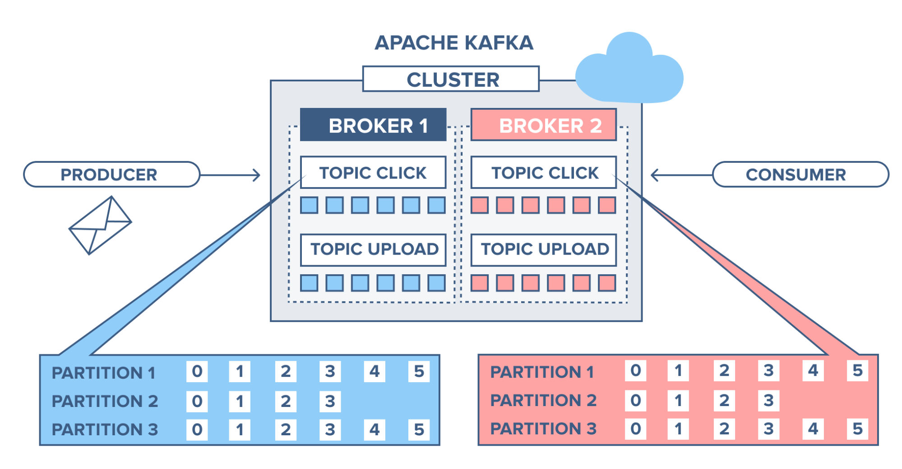

# Apache Kafka

   - **Apache Kafka** is an open-source distributed streaming platform that was originally developed at LinkedIn and later donated to the Apache Software Foundation. 

   - **Apache Kafka** is used for building real-time data pipelines and streaming applications that can process and analyze high volumes of data in real time. Kafka's distributed architecture, fault tolerance, and scalability make it an excellent choice for real-time data streaming and processing applications.

## Key Components

The key components of Apache Kafka are:

1. **Topics**: A topic is a category or feed name to which records are published. In Kafka, messages are published to topics and then processed by consumers.

2. **Producers**: A producer is a process or application that publishes messages (records) to a Kafka topic.

3. **Consumers**: A consumer is a process or application that subscribes to one or more topics and consumes messages (records) published to them.

4. **Brokers**: A broker is a Kafka server that stores and manages the records published to Kafka topics. Brokers are responsible for maintaining the durability and availability of Kafka data.

5. **ZooKeeper**: ZooKeeper is a distributed coordination service used by Kafka to manage the cluster membership, configuration, and synchronization between Kafka brokers.

6. **Connectors**: Kafka Connectors are pre-built components that can be used to connect Kafka to external data sources or sinks. Connectors simplify the process of building data pipelines by providing reusable code for common data integration tasks.

Overall, Kafka's distributed architecture, fault tolerance, and scalability make it an excellent choice for real-time data streaming and processing applications.
