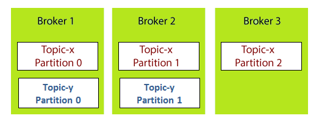

# Key Components

## Broker
- Brokers are the system that is responsible for maintaining the published data.
- Each broker may have one or more than one partitions.
- Kafka contains multiple brokers to maintain the load balancer.
- Kafka brokers are stateless (they do not need to take care of the state of consumers)

## Topic
- A specific category which keeps the stream of messages.
- Topics are split into partitions. There should be at least 1 partition.
- Each partition contains a message or payload in a non-modified ordered sequence.
- Each message within a partition has an identifier called an offset.

## Partition
- Partitions allow you to parallelize a topic by splitting the data in a topic across multiple brokers.
- Each partition has an identifier called an offset.
- Each partition can be placed on a separate machine to allow for multiple consumers to read the topic in parallel.
