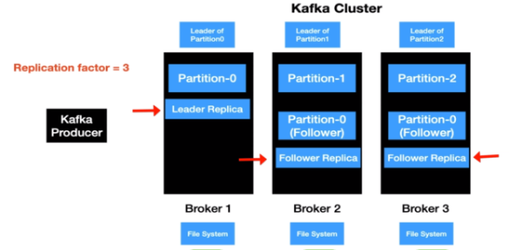

# Kafka Server: ISR-In-Sync Replicas



ISR refers to a subset of replicas for a particular partition that are considered in sync with the leader replica.

```yaml
version: '3'
services:
  kafka:
    image: confluentinc/cp-kafka:latest
    container_name: kafka
    ports:
      - "9092:9092"
    environment:
      # Replication factor for the internal offsets topic, which stores committed consumer offsets.
      KAFKA_OFFSETS_TOPIC_REPLICATION_FACTOR: 3
      # Replication factor for the transaction state log, used for storing transactional metadata.
      KAFKA_TRANSACTION_STATE_LOG_REPLICATION_FACTOR: 2
      # Set the minimum number of in-sync replicas for a message to be considered committed
      KAFKA_MIN_INSYNC_REPLICAS: '2' 

    volumes:
       - "./.data/kafka_etc:/etc/kafka"

```


