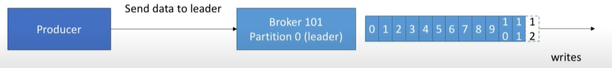
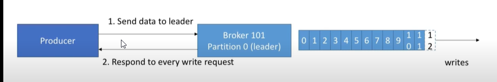
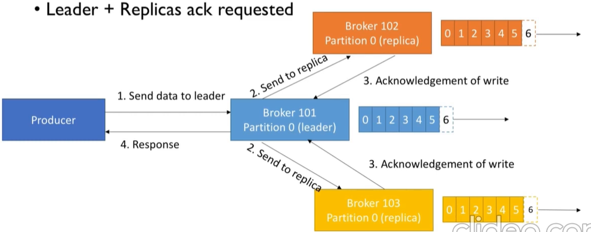
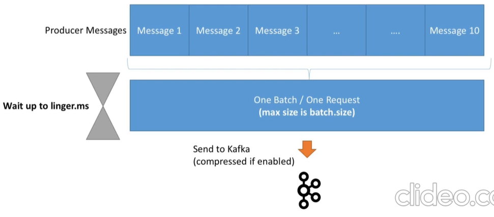
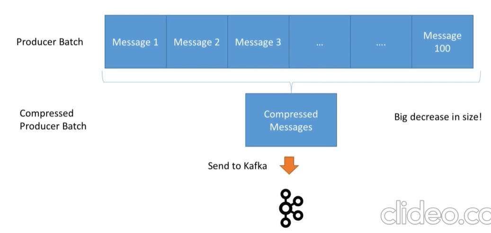

# Producer Configurations

Producer configurations play a crucial role in determining the behavior and performance of producers in a messaging system. Let's discuss three key properties related to producer configurations: `acks`, `batch.size`, and `compression.type`.

## Acknowledgment (acks)

The `acks` property in Kafka determines the level of acknowledgment a leader replica must receive from followers before considering a produce request successful. It can have three possible values:

- `acks=0`: The producer does not wait for any acknowledgment, which provides the lowest latency but also the lowest reliability. There is no guarantee that the message will be successfully delivered to the broker.

- `acks=1`: The leader replica acknowledges the produce request as soon as it is written to its local log. This provides better reliability than `acks=0` as the leader replica has confirmed receipt of the message. However, it is still possible that the message may be lost if the leader replica fails before replicating it to followers.

- `acks=all` (or `acks=-1`): The leader replica acknowledges the produce request only after all in-sync replicas (ISRs) have received and persisted the message. This provides the highest level of reliability but introduces additional latency since the producer has to wait for acknowledgment from all ISRs.

## Batch Size

- The `batch.size` property specifies the maximum amount of data (in bytes) that a producer can send in a single request. When a producer accumulates enough data to reach the `batch.size` threshold, it sends a batch of messages together in a single network request, which improves efficiency.

- Batching messages offers benefits in terms of throughput and network utilization. By sending multiple messages in a single request, producers can amortize the overhead of establishing network connections and reduce the number of network round-trips. This can significantly improve throughput and reduce latency.

- However, larger batch sizes also introduce increased memory usage and potentially higher latency, as the producer may have to wait longer to accumulate enough data to fill a batch. It's essential to strike a balance by setting an appropriate `batch.size` value based on the message size, frequency, and desired trade-off between throughput and latency.

## Compression Type

The `compression.type` property determines the compression algorithm to be used for compressing the message data. Kafka supports various compression types, including `none`, `gzip`, `snappy`, `lz4`, and `zstd`. Enabling compression can help reduce network bandwidth usage and storage requirements for the message data.

- By compressing messages before sending them over the network, less data needs to be transmitted, leading to lower network latency and reduced network congestion. Additionally, compressed data requires less storage space on disk or in memory, allowing for more efficient storage utilization.

- The choice of compression type depends on factors such as the desired level of compression, CPU utilization, and compatibility with consumer applications. Algorithms like `gzip` provide higher compression ratios but may incur higher CPU usage, while algorithms like `snappy` and `lz4` offer lower compression ratios but have lower CPU overhead.

## Summary

When configuring producers in the banking domain, some best practices to consider include:

- Setting `acks=all` to ensure high message reliability and minimize the risk of data loss.
- Adjusting the `batch.size` to an optimal value that balances message throughput and latency based on the specific workload characteristics.
- Choosing an appropriate compression algorithm (`compression.type`) that provides a good trade-off between compression ratio and CPU overhead. For example, `gzip` can be used for higher compression ratios, but `snappy` or `lz4` may be preferable for lower CPU overhead.

