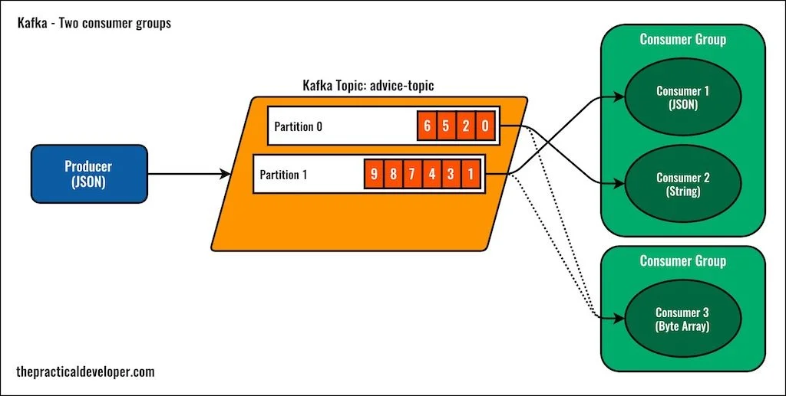
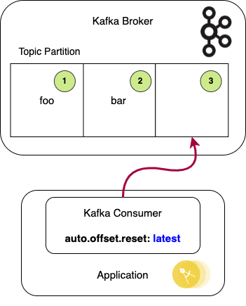
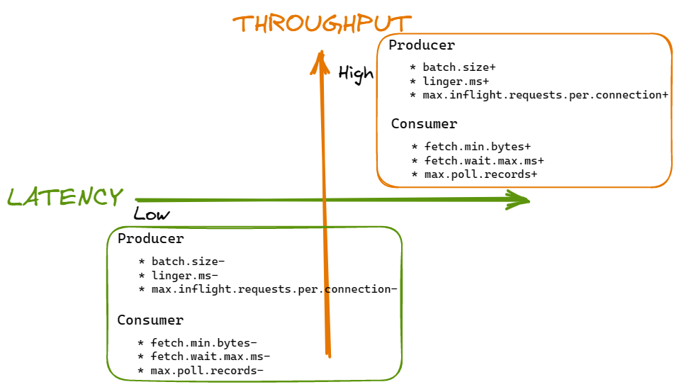

# Consumer Configurations

## group.id

The `group.id` property is used to identify and manage consumer groups within Kafka. A consumer group is a logical group of consumers that collaborate to consume and process messages from one or more Kafka topics. With `group.id`, Kafka can track the progress of each consumer within a group and ensure that partitions are consumed by only one consumer.

## auto.offset.reset

The `auto.offset.reset` property determines the behavior of a consumer when it joins a consumer group or loses its offset for a partition. It handles scenarios where a consumer starts consuming from a partition with no committed offset or when the committed offset is no longer valid. The possible values for `auto.offset.reset` are:

- "earliest": The consumer starts consuming from the earliest available offset.
- "latest": The consumer starts consuming from the latest offset.
- "none": An error is thrown if no offset is available.

Choosing the appropriate `auto.offset.reset` value ensures that consumers handle offset management effectively.

## fetch.min.bytes

The `fetch.min.bytes` property specifies the minimum amount of data (in bytes) that a consumer fetches from a Kafka broker in a single request. It determines the size of the message batch fetched by the consumer. Balancing between latency and throughput, the `fetch.min.bytes` value affects the trade-off between them. A higher value increases throughput but introduces higher latency, while a lower value reduces latency but increases the number of requests.

## Consumer Configuration Best Practices in the Banking Domain

In the banking domain, configuring consumers effectively is crucial for reliable message processing. Consider the following best practices:

1. **group.id**: Assign unique and descriptive `group.id` values to consumer groups associated with different applications or services. For example, "transactions-consumer-group" or "fraud-detection-consumer-group."

2. **auto.offset.reset**: Set `auto.offset.reset` to "earliest" to avoid missing critical events such as transactions or fraud alerts. This ensures that a consumer starts consuming from the earliest available offset when joining a consumer group or facing offset loss.

3. **fetch.min.bytes**: Choose an appropriate value for `fetch.min.bytes` based on the requirements of the banking application. For low latency, set a smaller value, while for high throughput, set a higher value. Test and monitor the performance to strike the right balance.

By following these best practices and monitoring consumer lag, configuring consumer groups in the banking domain becomes efficient and reliable.
